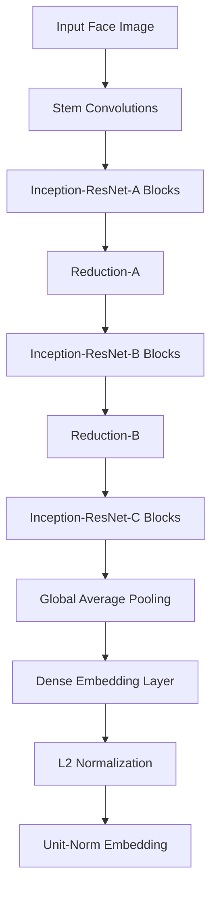
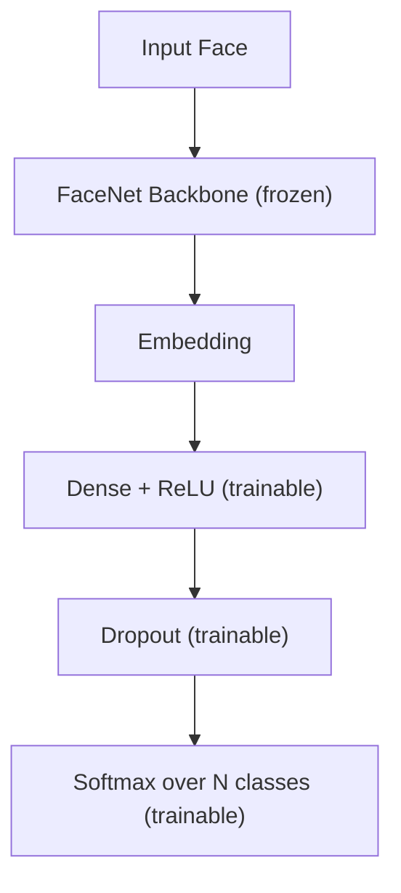

# Chapter 4: Methods and Algorithms for Face Recognition

## 4.1 Introduction

A face recognition system solves two problems in sequence: it locates every face inside a frame, then decides whose face each crop belongs to. Detection produces rectangles; recognition produces identities. A missed detection is a silent error the recognizer cannot correct, while a precise but mislabelled crop corrupts the downstream database.

This chapter describes the algorithms for each stage and derives the mathematics that governs them. For detection, a mobile-optimized deep network is compared against two classical detectors and a multi-stage convolutional cascade. For recognition, two paradigms are studied — closed-set classification and open-set embedding search — alongside three strategies for adapting a pre-trained FaceNet model.

## 4.2 Face Detection Methods

Before a face can be recognized, it must first be found. Detection is the prerequisite step that locates every face within an image or video frame, producing bounding boxes that subsequent stages process. This task is deceptively difficult: faces vary in scale from distant specks to close-up portraits, they appear at arbitrary orientations, and they must be distinguished from visually similar patterns such as hands, clothing textures, or background clutter.

Detection performance caps the entire pipeline: a detector that drops faces cannot be rescued downstream, and real-time video imposes a strict latency budget. The four detectors evaluated here represent different eras and priorities in computer vision research. They sit at distinct points on the speed–recall curve: one engineered for mobile inference, two classical approaches that predate deep learning, and one that trades speed for multi-scale recall through a multi-stage cascade.

### 4.2.1 MediaPipe BlazeFace

MediaPipe BlazeFace [1] is a lightweight single-shot detector built for mobile and edge inference. The detection pipeline proceeds as follows: the input image is resized to a fixed-size RGB tensor and fed through a backbone network built from depthwise separable convolutions. These convolutions factor each standard operation into a depthwise step (one filter per input channel) followed by a pointwise $1 \times 1$ convolution, cutting parameter count and multiply-accumulate operations by roughly an order of magnitude. The backbone produces feature maps at multiple scales, from which two parallel heads operate: a bounding-box regression head predicts face locations, and a landmark regression head predicts six facial landmarks (two eye centres, nose tip, mouth centre, and two tragions). The landmarks serve a dual purpose: they enable geometric alignment (rotating and rescaling so that the eyes lie on a horizontal line improves recognition on non-frontal poses) and they provide spatial verification that a detection is genuinely facial. An anchor-free design removes the need for hand-tuned scale priors by directly regressing box coordinates from feature points, allowing the network to detect faces across a continuous range of scales without predefined anchor boxes. While BlazeFace represents the current state of mobile-optimized detection, understanding its performance requires comparison against earlier approaches that established the foundations of real-time face detection.

### 4.2.2 Haar Cascade Classifier

The Haar cascade [2] is the historical baseline for real-time face detection, combining rectangular Haar-like features, the integral image, and a boosted cascade of increasingly selective classifiers. Given an input image $I(x, y)$, the integral image is

$$II(x, y) = \sum_{x' \leq x,\, y' \leq y} I(x', y').$$

The sum over any axis-aligned rectangle is then evaluated with four table lookups, making feature evaluation independent of window scale. A single Haar feature is the difference of two rectangle sums, chosen to respond to local intensity contrasts such as the one between an eye region and the cheek. From a large pool of candidate features, AdaBoost selects a discriminative subset and forms a strong classifier

$$H(x) = \operatorname{sign}\!\left(\sum_{t=1}^{T} \alpha_t h_t(x)\right),$$

where each $h_t$ is a thresholded weak classifier and $\alpha_t$ weights its contribution. Strong classifiers are chained into a cascade: early stages use few features to reject obvious non-faces quickly, while later stages spend more computation on surviving candidates. The detector was trained on upright frontal faces and deteriorates under rotation or partial occlusion. Both the Haar cascade and the next classical approach share a common philosophy: they rely on hand-engineered features rather than learned representations, differing primarily in what visual cues they extract.

### 4.2.3 Dlib HOG and Linear SVM

The Dlib face detector [4] pairs Histogram of Oriented Gradients features [3] with a linear Support Vector Machine. The image is partitioned into small cells, and at each pixel the derivatives $g_x$ and $g_y$ are combined into a gradient magnitude and orientation

$$m(x, y) = \sqrt{g_x^2 + g_y^2}, \qquad \theta(x, y) = \arctan\!\left(\frac{g_y}{g_x}\right).$$

Each pixel contributes its magnitude to one of nine orientation bins within its cell, and cells are grouped into overlapping blocks for contrast normalization. The concatenation of normalized block histograms forms a feature vector that captures local shape and edge structure while remaining approximately invariant to illumination. A linear SVM classifies HOG vectors from a sliding window at several scales as face or non-face. Explicit encoding of gradient direction lets the detector handle mild in-plane rotation better than the Haar cascade, though it cannot match deep detectors on profile views. The progression from Haar through HOG to the methods described next illustrates a shift from hand-crafted features to learned representations, with each stage trading computational cost for greater accuracy and robustness.

### 4.2.4 MTCNN

MTCNN [5] is a three-stage convolutional cascade that jointly optimizes detection and landmark alignment. The architecture processes an input image through three progressively more selective networks, with each stage filtering and refining the output of the previous one.

**P-Net (Proposal Network).** The first stage is a shallow fully convolutional network with three convolutional layers. It operates on an image pyramid built by repeatedly resizing the input image, allowing detection at multiple scales. At each pyramid level, P-Net performs two tasks simultaneously: binary classification (face vs. non-face) and bounding-box regression to refine candidate locations. The network produces a dense set of candidate bounding boxes at every spatial location and every pyramid level. Because P-Net is lightweight and operates on downsampled pyramid levels, it can quickly propose face candidates across the entire image, though many proposals will be false positives. Non-maximum suppression removes overlapping candidates before passing survivors to the next stage.

**R-Net (Refine Network).** The second stage is a deeper CNN with six convolutional layers followed by fully connected layers. R-Net receives the candidate boxes from P-Net at higher resolution (resized to 24×24 pixels) and performs three tasks: face classification, bounding-box regression, and non-face rejection. The deeper architecture and higher-resolution input allow R-Net to filter out the majority of false positives from P-Net while simultaneously refining the coordinates of true positives. The additional capacity learns more discriminative features that distinguish genuine faces from challenging background patterns that fooled the first stage.

**O-Net (Output Network).** The third and final stage is the most complex, with nine convolutional layers and fully connected layers. O-Net operates on the largest crops (resized to 48×48 pixels) and performs the complete multi-task objective: face classification, bounding-box regression, and landmark localization (five facial landmarks: left eye, right eye, nose, left mouth corner, right mouth corner). The high-resolution input and deep architecture enable precise localization and accurate landmark detection. Because only a small fraction of original candidates reach this stage, the computational cost is manageable despite the network's greater depth.

All three stages are trained jointly with a multi-task loss that combines face-versus-non-face classification (cross-entropy), bounding-box regression (Euclidean loss), and landmark regression (Euclidean loss). The weights of these loss components are tuned to balance detection accuracy, localization precision, and landmark accuracy. Non-maximum suppression is applied between stages to reduce redundancy. The cascade is slower than single-shot detectors because the pyramid is traversed three times and candidates are processed through three networks, but this staged approach is also what lets it recover small and partially occluded faces that single-shot detectors miss. Having established how faces are located, the next question is how they are identified once cropped and aligned.

## 4.3 Recognition Paradigms

Once a face has been cropped and aligned, recognition assigns it an identity. The two paradigms studied here make different assumptions about the identity set, and those assumptions propagate into architecture and workflow.

### 4.3.1 Closed-Set Recognition

Closed-set recognition assumes every probe belongs to one of $N$ identities seen during training. Given a probe $x$ and known classes $\{c_1, \dots, c_N\}$, the system returns

$$\hat{c} = \arg\max_{i \in \{1, \dots, N\}} P(c_i \mid x).$$

Posteriors are produced by a softmax over the logits $z_i$ of the final layer,

$$P(c_i \mid x) = \frac{\exp(z_i)}{\sum_{j=1}^{N} \exp(z_j)},$$

and the model minimizes categorical cross-entropy,

$$\mathcal{L}_{\mathrm{CE}} = -\sum_{i=1}^{N} y_i \log P(c_i \mid x),$$

where $y_i$ is the one-hot label. A rejection threshold on $P(\hat{c} \mid x)$ can flag low-confidence predictions as "Unknown", but this is a soft mechanism: the softmax distributes its mass among the known classes, forcing a truly unknown face into the least-bad bucket.

### 4.3.2 Open-Set Recognition

Open-set recognition lifts the fixed-class assumption. The model maps each face to an embedding $e = f(x) \in \mathbb{R}^{d}$ and compares it against a database of registered embeddings $\{e_1, \dots, e_M\}$ through a similarity function:

$$\hat{c} = \arg\max_{i \in \{1, \dots, M\}} \operatorname{sim}(e, e_i).$$

Cosine similarity is the natural choice,

$$\operatorname{sim}(a, b) = \frac{a \cdot b}{\|a\| \, \|b\|} = \frac{\sum_{i=1}^{d} a_i b_i}{\sqrt{\sum_{i=1}^{d} a_i^2} \sqrt{\sum_{i=1}^{d} b_i^2}},$$

because it measures the angle between vectors and ignores magnitude. When embeddings are L2-normalized, cosine similarity reduces to the dot product and lies in $[-1, 1]$. If the maximum similarity falls below a threshold $\tau$, the probe is rejected as genuinely unknown. Registering a new identity amounts to capturing a handful of samples, computing their embeddings, and writing them to the database; no retraining is involved. The paradigms therefore differ along two axes: enrollment cost and unknown-detection quality.

## 4.4 Deep Learning Architectures

The detection and recognition methods described in the preceding sections rely on neural network architectures whose design determines what they can learn and how efficiently they run. Understanding these architectures is essential for interpreting why certain methods succeed or fail, and for making informed choices when adapting pre-trained models to new domains. This section introduces the foundational building blocks — convolutional layers, hierarchical feature learning, and embedding spaces — that underpin modern face recognition systems.

### 4.4.1 Convolutional Neural Networks

Convolutional neural networks are the dominant architecture for face recognition. A CNN stacks convolutional layers with local, weight-shared receptive fields, which preserves translation equivariance and reduces parameter count relative to fully connected networks. The receptive field grows with depth: early layers respond to oriented edges and colour blobs, middle layers compose these into parts such as eye corners or nostrils, and late layers encode identity-level abstractions that remain stable across pose and illumination. This hierarchy is learned from data rather than designed by hand — the reason CNN-based recognizers overtook Eigenfaces, Local Binary Patterns, and HOG pipelines on every major benchmark.

### 4.4.2 FaceNet

FaceNet [6] turned face recognition into an embedding problem. Instead of classifying identities directly, the network learns a mapping $f : \mathcal{I} \to \mathbb{R}^{d}$ in which the squared Euclidean distance between two embeddings approximates face dissimilarity. The backbone used here is InceptionResNetV1.

Inception blocks apply parallel $1 \times 1$, $3 \times 3$, and $5 \times 5$ convolutions and a pooling branch at each resolution and concatenate the outputs, letting the network attend to patterns at several receptive-field sizes. Residual connections add each block's input to its output, keeping gradients stable during backpropagation. The final embedding is L2-normalized,

$$\tilde{e} = \frac{e}{\|e\|_2},$$

so that every embedding lies on the unit hypersphere. L2 normalization decouples direction, which encodes identity, from magnitude, which tends to capture image-quality artefacts.

## 4.5 Transfer Learning Strategies

Pre-trained FaceNet weights encode strong face priors but carry biases from the large celebrity corpus used for pre-training. Transfer learning adapts the model to the target domain while preserving representations that were expensive to learn. Three strategies are compared, spanning a spectrum from maximum preservation to full re-optimization.

### 4.5.1 Strategy A: Feature Extraction with a Frozen Backbone

The first strategy treats the pre-trained FaceNet as a fixed feature extractor. Every backbone parameter is frozen, and a shallow classification head — a dense ReLU layer, dropout, and a softmax over the enrolled identities — is attached to the embedding output.

Only the head receives gradient updates, so the optimizer touches a tiny fraction of the parameter budget. Convergence is fast because the embedding already separates identities linearly in most cases. The ceiling on performance is imposed by the frozen features: if a domain-specific cue is absent from the pre-trained representation, no amount of head retraining can recover it.

### 4.5.2 Strategy B: Progressive Unfreezing

The second strategy [7] gradually unfreezes the backbone from top to bottom while decreasing the learning rate. A typical schedule trains the head alone, releases the top of the backbone at a reduced rate, then a larger portion at a smaller rate, and finally the entire network at the smallest rate. Two design choices matter. The unfreezing order respects the hierarchical structure of CNN features: the head is stabilized first so that later backbone updates receive a sensible gradient, and deeper layers are released only after the layers above them have settled. The orders-of-magnitude decay in learning rate prevents catastrophic forgetting, which would otherwise overwrite the general-purpose priors before the head could steer the update.

### 4.5.3 Strategy C: Metric Learning with Triplet Loss

The third strategy optimizes the embedding geometry directly instead of attaching a classifier. A triplet $(x^a, x^p, x^n)$ contains an anchor, a positive from the same identity, and a negative from a different identity. The loss [6] is

$$\mathcal{L}_{\mathrm{triplet}} = \sum_{i=1}^{N} \left[\, \|f(x_i^a) - f(x_i^p)\|_2^2 - \|f(x_i^a) - f(x_i^n)\|_2^2 + \alpha \,\right]_+,$$

where $[z]_+ = \max(0, z)$ is the hinge and $\alpha$ is a fixed margin. The loss is zero when the negative lies farther from the anchor than the positive by at least $\alpha$, and positive otherwise. Geometrically, $\alpha$ enforces a minimum angular gap between each identity cluster and its nearest out-of-class neighbour, which makes similarity-based retrieval robust. The mining strategy determines which triplets contribute gradient: random mining draws triplets uniformly, but most already satisfy the margin and yield zero gradient, whereas semi-hard mining selects negatives farther from the anchor than the positive yet still within the margin, balancing informativeness against stability. This strategy supports open-set recognition directly, since a new identity is added by storing embeddings rather than retraining a softmax layer.

## 4.6 Evaluation Metrics

Recognition performance is reported using Balanced Accuracy (BA) as the primary metric, supplemented by per-class precision, recall, and F1. When the evaluation set is imbalanced, standard accuracy is misleading: a classifier that always predicts the majority class reaches a high apparent score while failing on every other identity. BA removes that bias by weighting every class equally. It is the arithmetic mean of per-class recall,

$$\mathrm{BA} = \frac{1}{N} \sum_{c=1}^{N} \mathrm{Recall}_c = \frac{1}{N} \sum_{c=1}^{N} \frac{TP_c}{TP_c + FN_c},$$

where $N$ is the number of classes, $TP_c$ is the count of true positives for class $c$, and $FN_c$ is the count of false negatives. BA equals one under perfect recognition and falls toward $1/N$ as predictions approach uniform guessing, so the metric is directly interpretable regardless of class frequency.

Per-class precision and F1 complete the picture,

$$\mathrm{Precision}_c = \frac{TP_c}{TP_c + FP_c}, \qquad \mathrm{F1}_c = 2 \cdot \frac{\mathrm{Precision}_c \cdot \mathrm{Recall}_c}{\mathrm{Precision}_c + \mathrm{Recall}_c},$$

with $FP_c$ the count of false positives. Precision captures how often a prediction of class $c$ is correct, recall captures how often an instance of $c$ is recovered, and F1 is their harmonic mean. Macro-averaging weights every identity equally — important in surveillance, where every enrolled person matters regardless of appearance frequency.

## References

[1] Bazarevsky, V., Kartynnik, Y., Vakunov, A., Raveendran, K., & Grundmann, M. (2019). BlazeFace: Sub-millisecond neural face detection on mobile GPUs. *arXiv:1907.05047*. https://arxiv.org/pdf/1907.05047

[2] Viola, P., & Jones, M. (2001). Rapid object detection using a boosted cascade of simple features. *CVPR 2001*, 511-518. https://doi.org/10.1109/CVPR.2001.990517

[3] Dalal, N., & Triggs, B. (2005). Histograms of oriented gradients for human detection. *CVPR 2005*, 886-893. https://doi.org/10.1109/CVPR.2005.177

[4] King, D. E. (2009). Dlib-ml: A machine learning toolkit. *Journal of Machine Learning Research*, 10, 1755-1758. https://jmlr.org/papers/v10/king09a.html

[5] Zhang, K., Zhang, Z., Li, Z., & Qiao, Y. (2016). Joint face detection and alignment using multitask cascaded convolutional networks. *IEEE Signal Processing Letters*, 23(10), 1499-1503. https://doi.org/10.1109/LSP.2016.2603342

[6] Schroff, F., Kalenichenko, D., & Philbin, J. (2015). FaceNet: A unified embedding for face recognition and clustering. *CVPR 2015*, 815-823. https://arxiv.org/pdf/1503.03832

[7] Howard and Ruder. Universal Language Model Fine-tuning for Text Classification.
