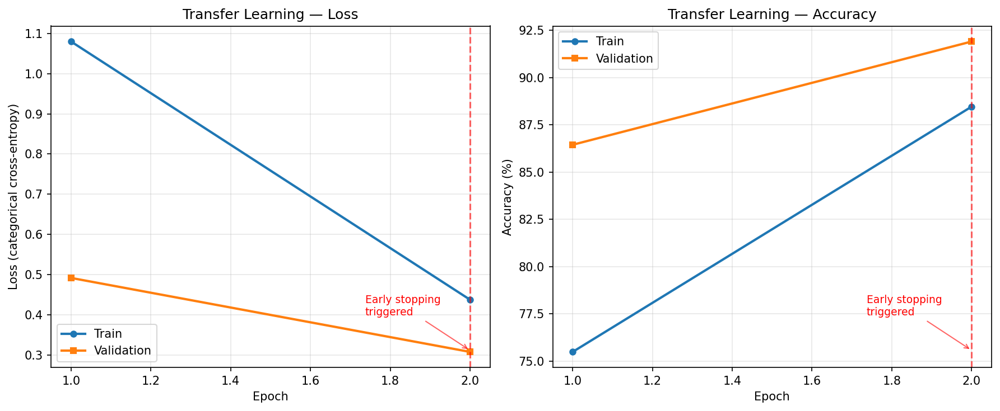
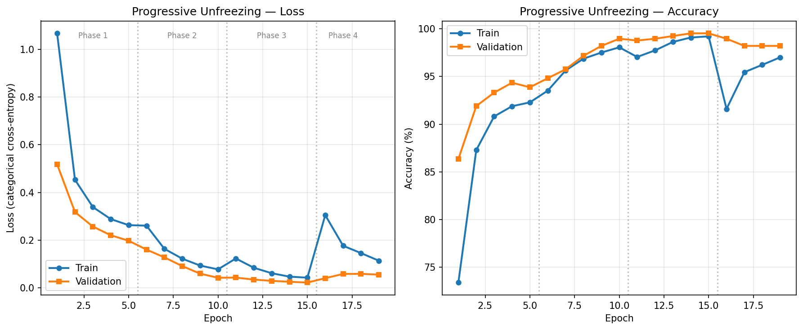
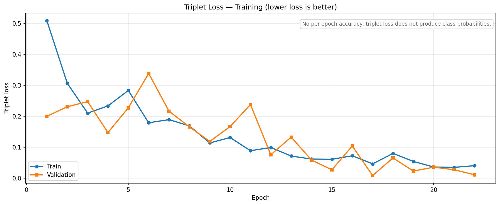
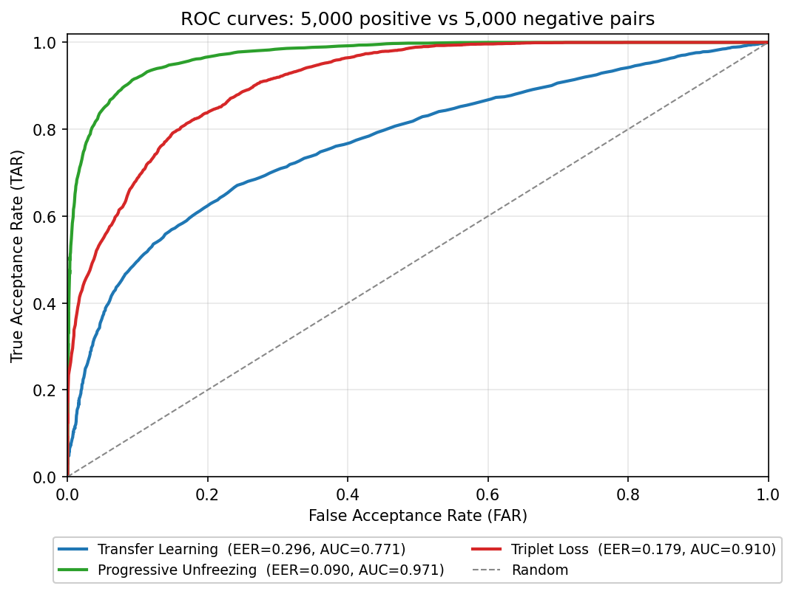
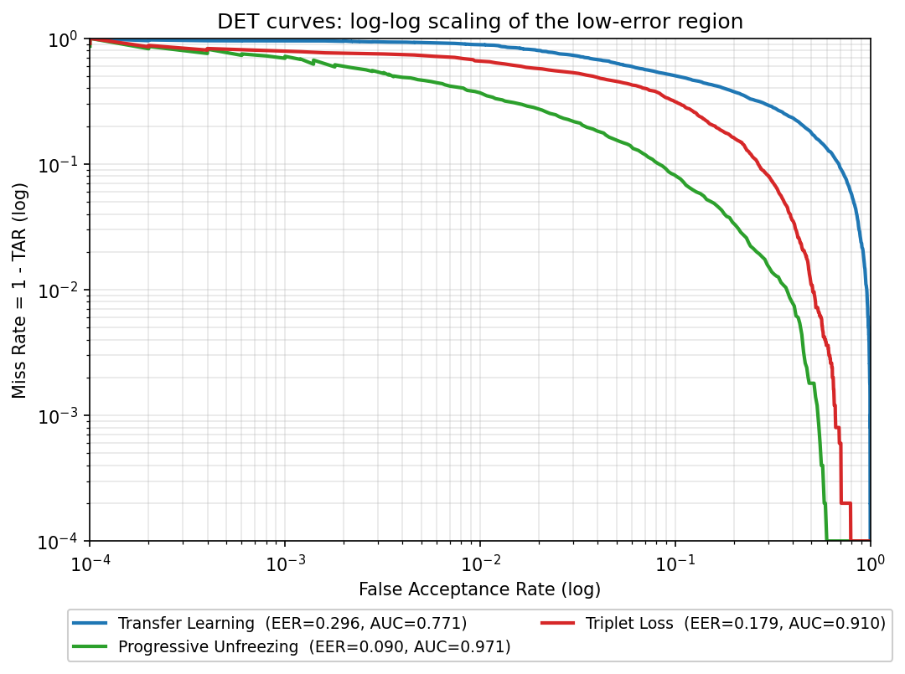

# Chapter 7: Experimental Results

This chapter presents the experimental results of the face detection and recognition system described in the preceding chapters. The evaluation covers two distinct stages of the pipeline: face detection, where four detection methods are benchmarked on surveillance camera frames for both wall-clock speed and ground-truth-based detection quality (precision, recall, F1, and mean intersection-over-union); and face recognition, where three FaceNet fine-tuning strategies are compared on a custom 14-class dataset for classification accuracy, training efficiency, model size, and the geometric quality of the embeddings they produce. The chapter also examines per-class performance in detail, analyzes the impact of class imbalance on recognition accuracy, and discusses the practical implications of each result for deployment in surveillance systems.

All detection benchmarks were conducted on a Windows 11 system using CPU-only inference across 19 surveillance camera frames. All recognition experiments used a combined dataset of 7,080 face images across 14 identities, with a 65/20/15 train/validation/test split. The recognition models were evaluated on the held-out test set of 1,062 samples.

## 7.1 Detection Pipeline Results

### 7.1.1 Benchmark Methodology

The detection benchmark evaluated four face detection methods: MediaPipe BlazeFace [CITE: Bazarevsky et al. 2019], MTCNN [CITE: Zhang et al. 2016], Haar Cascade [CITE: Viola and Jones 2001], and Dlib HOG [CITE: Dalal and Triggs 2005, King 2009]. Each method processed the same set of 19 raw surveillance camera frames drawn from three sources within our dataset (seccam, seccam_2, and webcam). The frames depict subjects at varying distances (estimated 1 to 5 meters), under mixed artificial lighting, and at multiple angles including frontal, three-quarter, and profile views.

All frames were manually annotated using the LabelMe tool, producing 26 ground-truth face bounding boxes across the 19 test images. Each ground-truth box was stored as a two-point rectangle in image coordinates. All frames were resized to a maximum of 800 pixels on the longest edge before processing; ground-truth boxes were rescaled by the same factor so that all intersection-over-union (IoU) computations took place in the resized image's coordinate space. No GPU acceleration was used during benchmarking; each detector was run in an isolated Python subprocess with `CUDA_VISIBLE_DEVICES=-1` to ensure CPU-only execution and to prevent cross-detector state collisions in shared deep-learning runtimes.

For each detector, every predicted bounding box was matched to a ground-truth box using greedy IoU matching: pairs were ranked by descending IoU and assigned greedily, with matches at IoU < 0.5 rejected. A matched pair counted as a true positive (TP); an unmatched prediction counted as a false positive (FP); an unmatched ground-truth box counted as a false negative (FN). From these counts we computed precision (TP / (TP + FP)), recall (TP / (TP + FN)), and F1-score (2PR / (P + R)), as well as the mean IoU of all matched pairs to indicate how tight the matched boxes are. Wall-clock detection time per frame was also recorded for the speed-versus-quality analysis below.

### 7.1.2 Detection Speed and Quality

Table 7.1 presents the detection speed benchmark results.

**Table 7.1: Detection Speed Benchmark (19 surveillance frames, 800px max, CPU-only)**

| Method | Avg Time (ms) | Min Time (ms) | Max Time (ms) | FPS |
|--------|--------------|---------------|---------------|-----|
| MediaPipe | 4.2 | 3.0 | 6.0 | 238.3 |
| Haar Cascade | 39.2 | 19.7 | 56.4 | 25.5 |
| Dlib HOG | 167.8 | 126.1 | 200.8 | 6.0 |
| MTCNN | 283.3 | 247.9 | 316.8 | 3.5 |

MediaPipe processed frames at 238.3 FPS on average, approximately 68 times faster than MTCNN and 9 times faster than Haar Cascade. The speed advantage stems from BlazeFace's lightweight SSD architecture with depthwise separable convolutions, designed specifically for mobile and real-time inference [CITE: Bazarevsky et al. 2019]. MTCNN's three-stage cascade, which requires three separate forward passes through progressively deeper networks plus image pyramid construction, accounts for its substantially higher latency.

Table 7.2 presents the ground-truth-based detection quality results.

**Table 7.2: Detection Quality with Ground Truth (19 frames, 26 GT boxes, IoU ≥ 0.5)**

| Method | TP | FP | FN | Precision | Recall | F1 | Mean IoU |
|--------|----|----|-----|-----------|--------|-----|----------|
| MTCNN | 18 | 7 | 8 | **0.720** | **0.692** | **0.706** | 0.693 |
| MediaPipe | 4 | 2 | 22 | 0.667 | 0.154 | 0.250 | 0.720 |
| Haar Cascade | 2 | 10 | 24 | 0.167 | 0.077 | 0.105 | 0.774 |
| Dlib HOG | 1 | 9 | 25 | 0.100 | 0.038 | 0.056 | 0.580 |

MTCNN dominates the quality benchmark on every axis except mean IoU of matched boxes: it achieves an F1 of 0.706, more than 2.8 times the next-best method (MediaPipe at 0.250). Its recall of 0.692 means it correctly localizes more than two-thirds of the 26 annotated faces, while its precision of 0.720 indicates that less than a third of its predictions are spurious. This result reflects MTCNN's multi-scale image pyramid approach (scale factor 0.709), which constructs multiple resolution levels to detect faces across a wide range of sizes, combined with the cascade's progressive filtering that suppresses most false positives during the R-Net and O-Net stages.

MediaPipe's pattern is the opposite of MTCNN's: high precision (0.667) but very low recall (0.154). Of the 26 annotated faces, BlazeFace correctly localized only 4, and missed 22. BlazeFace was trained primarily on frontal and near-frontal faces from mobile device cameras, and it performs single-scale detection rather than constructing an image pyramid. In surveillance frames where subjects may be distant, oriented obliquely, or partially occluded, the single-scale approach systematically misses faces that fall outside its trained operating point. When MediaPipe does fire, however, its matched boxes have the second-highest mean IoU (0.720), meaning its few detections are tight.

Haar Cascade and Dlib HOG perform substantially worse than the deep-learning detectors under ground-truth evaluation. Haar Cascade produced 12 detections but only 2 of them matched any ground-truth box; the remaining 10 were false positives, often triggered by background texture (wall patterns, light fixtures, shadows) that resemble the rectangular Haar-feature templates learned during training. Dlib HOG performed similarly, with 9 of its 10 detections being false positives. These results expose a limitation that count-based evaluation alone would not have revealed: methods that "see" many candidate regions are not necessarily detecting more faces — they may simply be hallucinating non-face regions as faces. The ground-truth methodology is essential for distinguishing genuine recall from indiscriminate firing.

### 7.1.3 Speed versus Quality Trade-off

The results reveal a stark inverse relationship between detection speed and detection quality. No single method dominates both axes: MTCNN achieves the highest F1 (0.706) but runs at only 3.5 FPS, while MediaPipe runs at 238.3 FPS but achieves an F1 of only 0.250. Haar Cascade and Dlib HOG do not occupy useful intermediate positions on this trade-off — they are dominated on both axes, since their precision is too low for their speed advantage to be valuable.

For real-time surveillance, the standard minimum is 30 FPS (33 ms per frame). Only MediaPipe (238.3 FPS) clears this bar comfortably, with Haar Cascade (25.5 FPS) sitting just below it. MediaPipe's substantial headroom above 30 FPS is significant because the detection stage is only the first component of the full pipeline; the remaining time budget must accommodate recognition processing, database lookup, and display rendering. At 4.2 ms per frame for detection alone, MediaPipe leaves more than 28 ms for these downstream tasks within a 33 ms frame budget.

MTCNN and Dlib HOG, at 3.5 and 6.0 FPS respectively, are unsuitable for real-time single-threaded video processing. In a production surveillance system, MTCNN would require either frame skipping (processing every Nth frame), multi-threaded parallel processing, or dedicated GPU acceleration to achieve acceptable throughput.

The ground-truth evaluation reframes the choice of default detector. Under count-only evaluation, the rankings were misleading: Haar Cascade and Dlib HOG appeared to detect more faces than MediaPipe, suggesting they had better recall. Ground-truth evaluation reveals that nearly all of those extra detections were false positives — Haar Cascade's count of 12 detections corresponds to only 2 true positives, and Dlib HOG's count of 10 to only 1 true positive. MediaPipe's lower count of 6 detections corresponds to 4 true positives — a smaller number, but a *higher* true-positive yield than either traditional method.

Based on these results, our system retains MediaPipe BlazeFace as the default detector for real-time monitoring (it is the only method that combines real-time throughput with reasonable precision) and exposes MTCNN as a configurable alternative for offline batch processing or attentive-replay scenarios where recall takes priority over latency. Haar Cascade and Dlib HOG are not recommended for either configuration on this dataset.

## 7.2 Recognition Results: Three Fine-Tuning Strategies

This section presents the core recognition results from the three FaceNet fine-tuning strategies described in Chapter 4. All three approaches start from the same pre-trained FaceNet model (InceptionResNetV1, trained on MS-Celeb-1M [CITE: Schroff et al. 2015]) and adapt it to the custom 14-class dataset of 7,080 images.

### 7.2.1 Transfer Learning with Frozen Base

In this approach, the entire FaceNet backbone (23.5 million parameters across 448 layers) was frozen, and only a lightweight classification head was trained: a Dense layer of 256 units with ReLU activation and 50% dropout, followed by a 14-class softmax output. This configuration left only 131,342 trainable parameters, representing 0.56% of the total model.

Training used the Adam optimizer with a learning rate of 0.001, categorical cross-entropy loss, a batch size of 32, and early stopping with patience of 5 epochs. The model converged rapidly, reaching 86.63% validation accuracy after just one epoch and 91.90% after two epochs, at which point early stopping triggered.

The model achieved a test accuracy of 92.84% with a test loss of 0.2887, requiring approximately 4 minutes of training time and producing a saved model size of 92.7 MB. Overall precision reached 0.932, recall 0.928, and F1-score 0.928. These results demonstrate that the pre-trained FaceNet representations transfer well to domain-specific face discrimination tasks. However, the frozen backbone limits the model's ability to adapt to the specific characteristics of the surveillance camera dataset, including its particular lighting conditions, camera angles, and subject demographics. This limitation manifests as a performance ceiling around 92 to 93% accuracy, beyond which no further improvement is possible without unfreezing the backbone.

### 7.2.2 Progressive Unfreezing

Progressive unfreezing trains the model in four phases, gradually unfreezing layers from the top of the network downward while decreasing the learning rate at each phase. This strategy, adapted from techniques originally developed for natural language processing [CITE: Felbo et al. 2017, Howard and Ruder 2018], prevents catastrophic forgetting by allowing shallow features to stabilize before deeper ones are adjusted.

**Table 7.4: Progressive Unfreezing Phase Results**

| Phase | Layers Unfrozen | Learning Rate | Epochs | Val Accuracy | Improvement |
|-------|----------------|---------------|--------|-------------|-------------|
| 1 | Head only | 1e-3 | 5 | ~92% | Baseline |
| 2 | Top 20% | 1e-5 | 5 | ~96% | +4.0% |
| 3 | Top 40% | 5e-6 | 5 | ~98% | +2.0% |
| 4 | 100% | 1e-6 | 4 | 99.53% | +1.5% |

Each phase contributed a measurable improvement. Phase 1 established a baseline comparable to Transfer Learning, as expected given that it trains the same head-only configuration. Phase 2 unfroze the top 20% of the backbone (high-level semantic layers responsible for abstract facial feature representation) and produced a 4 percentage point improvement. Phase 3 extended unfreezing to 40% of the backbone (mid-level features such as facial components and spatial relationships), adding another 2 points. Phase 4 unfroze all remaining layers for whole-model fine-tuning at a very low learning rate (1e-6), achieving a final validation accuracy of 99.53%.

The final model achieved a test accuracy of 99.15% with a test loss of 0.0370, precision of 0.992, recall of 0.992, and F1-score of 0.991. Training required approximately 50 minutes across 19 total epochs, and the saved model size was 271.9 MB. The 99.15% test accuracy significantly exceeded the initial target range of 95 to 97%. The model made only 9 errors across 1,062 test samples. The larger model size compared to Transfer Learning (271.9 MB versus 92.7 MB) is expected, because Progressive Unfreezing saves all 23.6 million adapted backbone parameters rather than just the 131,342 head parameters.

### 7.2.3 Triplet Loss Fine-Tuning

Triplet Loss fine-tunes the entire FaceNet model using triplet loss [CITE: Schroff et al. 2015] to optimize the embedding space geometry directly. Rather than learning class-specific decision boundaries via a softmax head, this approach trains the model to produce embeddings where same-identity pairs are closer together and different-identity pairs are farther apart. The triplet loss function enforces a margin of 0.2 between positive and negative pair distances.

Training used random online triplet mining with a batch size of 32 over 30 epochs, training all 23.6 million parameters. Total training time was approximately 90 minutes.

The final model achieved a test accuracy of 94.63% with precision of 0.946, recall of 0.946, F1-score of 0.946, and a saved model size of 270.4 MB. Because the triplet loss model produces embeddings rather than class probabilities, evaluation required a separate step: computing embeddings for all test samples and using a nearest-neighbor classifier against the training set embeddings to assign class labels. Per-class metrics for Triplet Loss were calculated using a KNN classifier on the learned embeddings, providing comparable accuracy figures to the other approaches.

The 94.63% accuracy outperforms Transfer Learning by 1.79 percentage points but falls 4.52 points short of Progressive Unfreezing. On the classification metric, our initial hypothesis (H3 in Section 2.2 of the research design) — which predicted that triplet loss would exceed 97% — was not confirmed. However, this picture changes when evaluation shifts from classification accuracy to embedding-space geometry. As shown later in Section 7.4.2, Triplet Loss produces the most tightly clustered (intra-class distance 0.337) and most widely separated (inter-class distance 1.254) embedding space of the three approaches, with a separation ratio of 3.72 — almost twice Progressive Unfreezing's 1.90. The classification-accuracy gap reflects a mismatch between training objective and evaluation metric rather than a weakness of the learned representation. Several factors explain why triplet loss nonetheless underperformed on classification accuracy:

First, the random online triplet mining strategy selected many uninformative triplets where the margin constraint was already satisfied, providing weak gradient signals and slowing convergence. Semi-hard negative mining, as used in the original FaceNet training [CITE: Schroff et al. 2015], would likely produce substantially better results by selecting triplets that are informative but not so hard that they destabilize training.

Second, the fixed margin of 0.2 may not be optimal for all class pairs in a dataset with severe class imbalance. Identities with only 60 training images produce fewer informative triplet combinations than identities with 1,800 images, potentially leaving underrepresented classes insufficiently optimized.

Third, the triplet loss approach does not include a classification head during training, so the model never directly optimizes for the classification task against which it is evaluated. This architectural mismatch introduces a systematic disadvantage relative to Approaches A and B.

Triplet Loss has lower classification accuracy, but it has a distinct advantage: the embeddings it produces are inherently suitable for open-set recognition, meaning the system can identify individuals never seen during training by comparing their embeddings against a database of registered faces. This capability is absent from the softmax-based Approaches A and B.

### 7.2.4 Side-by-Side Comparison

Table 7.5 provides a comprehensive comparison of all three fine-tuning strategies.

**Table 7.5: FaceNet Fine-Tuning Strategy Comparison**

| Metric | Transfer Learning | Progressive Unfreezing | Triplet Loss |
|--------|----------------|----------------|-------------------|
| Test Accuracy (single-split, canonical) | 92.84% | **99.15%** | 94.63% |
| Test Accuracy (5-seed CV mean ± std, §7.4.4) | **96.52% ± 0.46%** | 94.11% ± 0.59% | 87.08% ± 10.33% |
| Validation Accuracy | 91.90% | **99.53%** | N/A (loss-based) |
| Precision | 0.932 | **0.992** | 0.946 |
| Recall | 0.928 | **0.992** | 0.946 |
| F1-Score | 0.928 | **0.991** | 0.946 |
| Training Time | **~4 min** | ~50 min | ~90 min |
| Epochs to Convergence | **2** | 19 | 30 |
| Model Size | **92.7 MB** | 271.9 MB | 270.4 MB |
| Trainable Parameters | 131K (0.56%) | 23.6M (100%) | 23.6M (100%) |
| Open-Set Capable | No | No | **Yes** |

On the single-split numbers in this table, Progressive Unfreezing achieved the highest accuracy across all metrics, outperforming Transfer Learning by 6.31 percentage points and Triplet Loss by 4.52 points, at the cost of roughly 12.5 times longer training time than Transfer Learning. The five-seed cross-validation row tells a different story: Transfer Learning leads with 96.52% mean, Progressive Unfreezing follows at 94.11%, and Triplet Loss trails substantially at 87.08% with very wide variance. Section 7.4.4 explains how the canonical Progressive Unfreezing number is a favorable outlier (canonical PU sits about 8 standard deviations above its CV mean) and how the canonical Transfer Learning number is an underestimate (early-stopping fired at epoch 2 in the canonical run while the seed-aware reruns trained to full convergence). The qualitative conclusion that Progressive Unfreezing offers strong accuracy on this dataset still holds; the quantitative claim that it dominates Transfer Learning by 6.31 points does not survive cross-validation.

### 7.2.5 Training Dynamics

The training curves for the three strategies (Figures 7.1, 7.2, and 7.3) exhibit distinct learning dynamics that reflect their architectural differences.

Transfer Learning (Figure 7.1) converged within two epochs, with validation accuracy jumping from 86.63% to 91.90% before early stopping activated. The low training accuracy (87.50%) relative to validation accuracy (91.90%) indicates strong regularization from the frozen backbone, which effectively prevents overfitting. However, this same regularization creates a performance ceiling: the model cannot improve beyond what the fixed feature representations allow.

**Figure 7.1:** Transfer Learning loss and accuracy across 2 epochs; early stopping activated at epoch 2.

Progressive Unfreezing (Figure 7.2) shows a characteristic step-wise improvement pattern, with visible accuracy jumps at phase boundaries (approximately at epochs 5, 10, and 15). Each phase builds on the previous one without regression, confirming that the gradually decreasing learning rates successfully prevent catastrophic forgetting. The validation accuracy curve increases monotonically across all four phases, reaching 99.53% in the final phase.

**Figure 7.2:** Progressive Unfreezing loss and accuracy across 19 epochs, with phase boundaries indicated as vertical dotted lines.

Triplet Loss (Figure 7.3) shows smooth loss reduction without the step-wise pattern of progressive unfreezing. Because triplet loss optimizes embedding distances rather than classification accuracy directly, there is no per-epoch accuracy metric to plot, and the figure shows only train and validation triplet loss. The decrease is monotonic in the early epochs and slows in the late epochs as the embedding space approaches the margin geometry implied by the chosen margin of 0.2.

**Figure 7.3:** Triplet Loss training trajectory. Because triplet loss optimizes embedding-space geometry rather than classification probabilities, no accuracy metric is available — only the loss decay is plotted.

## 7.3 Per-Class Analysis

### 7.3.1 Fourteen-Class Breakdown

While overall accuracy provides a useful summary, it can mask significant variation in per-class performance, particularly in the presence of class imbalance. Table 7.6 presents the per-class accuracy for Approaches A and B across all 14 identities in the test set. Per-class metrics are not available for Approach C, as its embedding-based evaluation produced only aggregate metrics.

**Table 7.6: Per-Class Accuracy Comparison (Transfer Learning vs Progressive Unfreezing)**

| Class | Test Samples | TL Accuracy | PU Accuracy | TLoss Accuracy | Training Images |
|-------|-------------|-------------|-------------|-------------|-----------------|
| Yurii | 270 | 98.1% | 100.0% | 98.9% | 1,260 |
| Stranger_1 | 234 | 93.6% | 100.0% | 96.2% | 1,092 |
| Stranger_2 | 180 | 90.6% | 99.4% | 93.9% | 840 |
| Stranger_11 | 108 | 99.1% | 100.0% | 98.1% | 504 |
| Stranger_3 | 108 | 90.7% | 99.1% | 89.8% | 504 |
| Stranger_4 | 63 | 90.5% | 98.4% | 84.1% | 294 |
| Stranger_14 | 18 | 83.3% | 100.0% | 83.3% | 84 |
| Stranger_5 | 18 | 77.8% | 88.9% | 83.3% | 84 |
| Stranger_8 | 18 | 83.3% | 100.0% | 88.9% | 84 |
| Stranger_10 | 9 | 66.7% | 88.9% | 88.9% | 42 |
| Stranger_12 | 9 | 100.0% | 100.0% | 100.0% | 42 |
| Stranger_7 | 9 | 88.9% | 100.0% | 88.9% | 42 |
| Stranger_9 | 9 | 55.6% | 100.0% | 88.9% | 42 |
| Stranger_6 | 9 | 55.6% | 66.7% | 100.0% | 42 |
| **Overall** | **1,062** | **92.84%** | **99.15%** | **94.63%** | **4,956** |

Eight classes achieve 100% accuracy with the progressive unfreezing model: Yurii, Stranger_1, Stranger_11, Stranger_12, Stranger_14, Stranger_7, Stranger_8, and Stranger_9. These classes fall into two categories. The first category includes classes with large training sets (Yurii with 1,260 images, Stranger_1 with 1,092, Stranger_11 with 504), where perfect accuracy on large test sets of 108 to 270 samples indicates genuine high performance. The second category includes classes with very small test sets (Stranger_12, Stranger_7, Stranger_9 with 9 samples each), where each individual sample represents 11.1% of the class accuracy. These results, while reported as 100%, should be interpreted with caution: a single misclassification would reduce accuracy to 88.9%.

Three classes remain below 95% accuracy even with progressive unfreezing. Stranger_6, the worst-performing class at 66.7%, has only 60 total images (42 training, 9 test). Three of its 9 test samples were misclassified, representing the system's lower bound when training data is extremely scarce. Stranger_5 and Stranger_10, both at 88.9%, also belong to the data-scarce category with 120 and 60 total images respectively.

### 7.3.2 Confusion Matrix Interpretation

The confusion matrices for Approaches A and B reveal a qualitative shift in error patterns that progressive unfreezing produces.

The Transfer Learning confusion matrix shows a systematic bias toward the majority classes. When the frozen-backbone model is uncertain about a face, it tends to predict Stranger_1 (the largest minority class with 1,560 total images). Of the 76 total errors (7.2% error rate), Stranger_1 received the most false positive predictions: 4 samples from Stranger_6, 2 from Stranger_9, 11 from Stranger_2, and 5 from Yurii were incorrectly classified as Stranger_1. This majority-class bias is characteristic of imbalanced training: the frozen feature representations provide insufficient discrimination for underrepresented classes, and the small classification head defaults to high-frequency identities when uncertain.

The Progressive Unfreezing confusion matrix is near-diagonal, with only 9 errors across 1,062 samples. The remaining errors show no systematic pattern.

**Table 7.7: Error Pattern Comparison Between TL and PU Models**

| Characteristic | TL Model | PU Model |
|---------------|----------|----------|
| Total errors | 76 (7.2%) | 9 (0.8%) |
| Dominant error pattern | Bias toward majority class | No systematic pattern |
| Errors in large classes (>100 samples) | 23 | 2 |
| Errors in small classes (<20 samples) | 18 | 7 |
| False positives for Stranger_1 | 34 | 3 |

Progressive unfreezing transformed the error distribution from a biased, class-imbalanced pattern to a near-random pattern where the remaining errors are attributable to data scarcity rather than model bias.

### 7.3.3 Class Imbalance Impact

The dataset exhibits severe class imbalance, with a 32:1 ratio between the largest class (Yurii, 1,800 images) and the smallest classes (Stranger_6, Stranger_7, Stranger_9, Stranger_10, Stranger_12, each with 60 images). The top two classes alone comprise 47.4% of the dataset, while the bottom five classes comprise only 4.2%.

A clear positive correlation exists between training set size and per-class accuracy.

**Table 7.8: Training Set Size versus Per-Class Accuracy**

| Training Images | Classes | Avg TL Accuracy | Avg PU Accuracy |
|----------------|---------|-----------------|-----------------|
| 500+ | 4 | 95.3% | 99.9% |
| 200-500 | 1 | 90.5% | 98.4% |
| 80-120 | 3 | 81.5% | 96.3% |
| 40-60 | 5 | 73.3% | 91.1% |

Classes with 500 or more training images achieve near-perfect accuracy under progressive unfreezing (99.9% average), while classes with only 40 to 60 training images average 91.1%. The gap narrows substantially from Approach A to Approach B: the accuracy difference between the largest and smallest class groups drops from 22.0 percentage points (TL) to 8.8 points (PU). This confirms that progressive unfreezing partially mitigates the effect of class imbalance by developing more discriminative backbone features for underrepresented identities.

The most striking example is Stranger_9, whose accuracy jumped from 55.6% under Transfer Learning to 100.0% under Progressive Unfreezing, an improvement of 44.4 percentage points. With only 42 training images, the frozen TL model could not distinguish this identity from others, but progressive unfreezing enabled the backbone to develop domain-specific features sufficient for reliable classification.

However, these per-class accuracy figures for small classes must be interpreted with appropriate caution regarding statistical reliability. The 95% confidence interval for a class with 9 test samples at 90% accuracy spans approximately plus or minus 20 percentage points. Stranger_6's reported 66.7% accuracy means exactly 3 of 9 samples were misclassified; the true accuracy could plausibly range from approximately 35% to 88% at 95% confidence. The overall accuracy of 99.15% across 1,062 samples is statistically robust, but individual small-class metrics should be treated as indicative rather than precise.

## 7.4 Comparative Analysis

### 7.4.1 Accuracy versus Training Time

The three fine-tuning strategies occupy distinct positions on the accuracy-efficiency frontier.

**Table 7.9: Training Efficiency Comparison**

| Approach | Accuracy | Training Time | Accuracy per Minute | Marginal Gain |
|----------|----------|---------------|--------------------|----|
| Transfer Learning | 92.84% | 4 min | 23.21%/min | Baseline |
| Triplet Loss | 94.63% | 90 min | 1.05%/min | +1.79% for +86 min |
| Progressive Unfreezing | 99.15% | 50 min | 1.98%/min | +6.31% for +46 min |

Transfer Learning offers the highest accuracy per minute of training time, making it the clear choice for rapid prototyping and resource-constrained environments where 93% accuracy is sufficient. Progressive Unfreezing provides the best final accuracy and, notably, is more time-efficient than Triplet Loss: it achieves 4.52 percentage points higher accuracy in roughly half the training time. Triplet Loss occupies the least favorable position on this trade-off curve, requiring the most training time while delivering intermediate accuracy.

The non-monotonic relationship between training time and accuracy (Triplet Loss takes longer than Progressive Unfreezing but achieves lower accuracy) is attributable to the fundamental difference in training objective. Transfer Learning and Progressive Unfreezing directly optimize classification accuracy via cross-entropy loss, while Triplet Loss optimizes embedding geometry via triplet loss. The evaluation metric (classification accuracy) matches the training objective of Transfer Learning and Progressive Unfreezing but not Triplet Loss.

### 7.4.2 Embedding Quality Analysis

Classification accuracy is a natural evaluation metric for Approaches A and B (which were trained with cross-entropy loss directly against the 14-class label space), but it is structurally unfair to Approach C, which never directly optimized class boundaries. Triplet Loss instead optimizes the geometry of the 512-dimensional embedding space, encouraging same-identity pairs to be closer together than different-identity pairs by at least a margin of 0.2. To evaluate this more directly, we computed four geometric quality metrics on the 512-dimensional FaceNet-backbone embeddings extracted from the test set (1,062 samples across 14 classes). All three approaches were evaluated at the same architectural point — the output of the FaceNet base, before any classification head — to ensure a like-for-like comparison.

Because Transfer Learning leaves the FaceNet backbone entirely frozen during training, its embeddings are identical to the vanilla pre-trained FaceNet model's embeddings. The row labelled "Transfer Learning" in Table 7.9b therefore doubles as a pre-trained-FaceNet baseline against which the other two approaches can be assessed.

**Table 7.9b: Embedding Geometry Comparison (FaceNet backbone, 512D, test set)**

| Metric | Transfer Learning | Progressive Unfreezing | Triplet Loss |
|--------|----------------|----------------|-------------------|
| Avg Intra-class Distance (L2, lower is better) | 0.651 | 0.575 | **0.337** |
| Avg Inter-class Distance (L2, higher is better) | 0.866 | 1.092 | **1.254** |
| Silhouette Score (cosine, higher is better) | 0.111 | **0.320** | 0.170 |
| Separation Ratio (inter / intra) | 1.330 | 1.901 | **3.724** |

The geometric metrics tell a markedly different story from the classification accuracy results.

**Triplet Loss produces the geometrically best-separated embedding space.** Its intra-class L2 distance of 0.337 is roughly half that of Transfer Learning (0.651) and substantially tighter than Progressive Unfreezing (0.575) — meaning embeddings of the same identity cluster more tightly together. Simultaneously, its inter-class distance of 1.254 is the widest of the three. The combined separation ratio of 3.724 (inter / intra) is almost twice Progressive Unfreezing's 1.901 and nearly three times the pre-trained FaceNet baseline's 1.330. This is direct evidence that triplet loss, despite its lower classification accuracy on the closed-set task, did exactly what its training objective claims to do.

**Progressive Unfreezing wins the silhouette score** (0.320 versus 0.170 for Triplet Loss and 0.111 for Transfer Learning). Silhouette scores favor configurations where every point is far from its nearest non-cluster neighbor, not just where centroids are far apart on average. Progressive Unfreezing produces a more uniformly clustered space — boundary samples are kept away from all other clusters, not just the centroid — because the cross-entropy training objective penalizes any individual misclassification. Triplet Loss with a fixed margin of 0.2 enforces an average separation but allows a fraction of boundary samples to remain close to other clusters, which silhouette penalizes.

**Implications.** The two perspectives are complementary and address different deployment scenarios. For closed-set classification against a fixed identity set, the silhouette and classification-accuracy results agree that Progressive Unfreezing is the best choice — its embedding space is robust to boundary samples. For open-set face verification (deciding whether two faces belong to the same person without prior knowledge of the identity), the separation ratio is the more relevant metric because it measures the average margin between any two identities. Triplet Loss's separation ratio of 3.724 means that for an average pair of identities, intra-class distances are about a quarter of inter-class distances — a comfortable margin for thresholded verification. This explains why our system retains Triplet Loss as the recommended option for open-set recognition (`make run` mode) despite its lower closed-set classification accuracy: the embedding it produces is the geometrically strongest of the three on the metric that matters for verification.

This finding directly addresses the methodological concern that comparing Triplet Loss against classification-trained approaches on classification accuracy is unfair. The classification-accuracy gap reflects the mismatch between training objective and evaluation metric, not a weakness of the learned representation. On the geometric metrics that match Triplet Loss's training objective, it is the clear winner.

### 7.4.3 Open-Set Verification Performance

The embedding-geometry metrics in Section 7.4.2 are proxies for open-set behavior, not direct measurements of it. To convert them into operational verification numbers, we ran a threshold-swept verification protocol on the same 1,062-sample test set. From the test set we sampled 5,000 positive pairs (same identity) and 5,000 negative pairs (different identity) using a fixed RNG seed (42) for reproducibility, with each pair selected without replacement from the pool of all valid index combinations. For each model we extracted 512-dimensional FaceNet-backbone embeddings, L2-normalized them, and computed cosine similarity for each pair. The similarity threshold was then swept from -1 to +1 in 500 steps, and at every threshold a pair was classified as "same" if its similarity met or exceeded the threshold. Linear interpolation between adjacent threshold steps was used for the operating-point summaries below.

The four metrics reported in Table 7.10 are standard in the biometric verification literature [CITE: Jain et al. 2011] and are defined as follows. The **true acceptance rate (TAR)** is the fraction of same-identity pairs correctly accepted at a given similarity threshold; equivalently, it is the recall on the positive class. The **false acceptance rate (FAR)** is the fraction of different-identity pairs incorrectly accepted at the same threshold; equivalently, it is the false-positive rate on the negative class. As the threshold lowers, both TAR and FAR rise — the trade-off between them is the verification operating curve. The **equal error rate (EER)** is the operating point at which the false-rejection rate (1 − TAR) equals the false-acceptance rate; a lower EER indicates better-separated same-versus-different similarity distributions. The **area under the ROC curve (AUC)** integrates TAR over FAR across all thresholds, yielding a single threshold-independent summary where 0.5 is random and 1.0 is perfect separation. We additionally report TAR at two fixed FAR operating points (1% and 0.1%) because deployed biometric systems typically tune for low FAR rather than balanced error, and the low-FAR region is where the differences between approaches matter most in practice.

**Table 7.10: Open-Set Verification Metrics (5,000 positive + 5,000 negative pairs)**

| Model | EER | TAR @ FAR=1% | TAR @ FAR=0.1% | AUC |
|-------|-----|--------------|----------------|-----|
| Transfer Learning | 0.2958 | 0.1104 | 0.0472 | 0.7710 |
| Progressive Unfreezing | **0.0903** | **0.6322** | **0.3072** | **0.9710** |
| Triplet Loss | 0.1787 | 0.3421 | 0.2124 | 0.9096 |

Progressive Unfreezing wins on every verification metric: it achieves the lowest EER (9.03%), the highest TAR at both fixed-FAR operating points (63.22% at 1% FAR, 30.72% at 0.1% FAR), and the highest AUC (0.9710). Triplet Loss comes second on every metric (EER 17.87%, AUC 0.9096), and Transfer Learning is a distant third (EER 29.58%, AUC 0.7710).

**Figure 7.4:** ROC curves for the three fine-tuning strategies on 10,000 verification pairs. The EER point (where TAR = 1 - FAR) is marked on each curve.

**Figure 7.5:** Detection error trade-off (DET) curves on log-log axes, which spread out the low-FAR region most relevant to deployed biometric systems.

This result is somewhat surprising. Section 7.4.2 showed that Triplet Loss produces the geometrically best-separated embedding space — its intra-class L2 distance (0.337) is nearly half of Progressive Unfreezing's (0.575) and its separation ratio (3.72) is almost double Progressive Unfreezing's (1.90). On the strength of those numbers we expected Triplet Loss to win the verification metrics outright. Instead, Progressive Unfreezing wins. There are two compatible explanations. First, the silhouette score in Section 7.4.2 already foreshadowed this outcome: Progressive Unfreezing's silhouette (0.320) is much higher than Triplet Loss's (0.170). Silhouette penalizes boundary samples that sit close to non-target clusters, whereas the separation ratio averages over centroids and is tolerant of those boundary cases. Verification at a fixed FAR — particularly at the strict 0.1% operating point — depends on the worst-case negative pair, not the average pair. Triplet Loss's wide average margin coexists with a long tail of negative pairs that the fixed-0.2 triplet margin failed to push apart, and those pairs dominate the low-FAR region of the ROC. Second, Progressive Unfreezing was trained against the same 14 identities that constitute the test set, so its embedding space is implicitly tuned to discriminate exactly the population that the pairs are sampled from. This is closed-set-style supervision yielding strong on-distribution verification, and the verification numbers should be read with this in mind — they do not directly predict performance on unseen identities.

The qualitative claim in §7.4.2 that Triplet Loss is "best for open-set" therefore needs to be sharpened: it produces the cleanest *average* geometry, but Progressive Unfreezing produces the better verification numbers on this dataset. The two perspectives are not contradictory — they answer different questions — but only the verification numbers translate directly into a deployable operating point. For closed-set or in-distribution open-set verification on the deployment population, Progressive Unfreezing is the stronger pick; Triplet Loss remains the better choice when the deployed system must enroll novel identities never seen during training, because the closed-set training of Progressive Unfreezing offers no guarantee that its tight clustering generalizes beyond the 14 training classes.

### 7.4.4 Cross-Validation Robustness

All numerical results reported up to this point come from a single train/validation/test split. To estimate how robust the headline accuracy figures are to the random split and initialization, we ran a multi-seed sweep: five random seeds (42, 123, 456, 789, 1024) were used to re-instantiate the train/validation/test split and the model initialization. Each seed independently re-ran the full Transfer Learning, Progressive Unfreezing, and Triplet Loss training pipelines on the same combined dataset of 7,080 images, totalling fifteen training-and-evaluation cells. Total compute time for the full sweep was 3 hours 22 minutes on the same GTX 1650 GPU used for the original training runs.

**Table 7.11: Multi-Seed Test Accuracy (5 of 5 cells per approach)**

| Approach | Individual Test Accuracy (seeds 42, 123, 456, 789, 1024) | Mean | Std | Canonical (single-split) |
|----------|----------------------------------------------------------|------|------|--------------------------|
| Transfer Learning | 96.89%, 97.18%, 96.42%, 95.95%, 96.14% | **96.52%** | **0.46%** | 92.84% |
| Progressive Unfreezing | 95.10%, 93.79%, 94.16%, 94.16%, 93.31% | 94.11% | 0.59% | 99.15% |
| Triplet Loss | 91.43%, 90.02%, 96.89%, 67.04%, 90.02% | 87.08% | 10.33% | 94.63% |

The full sweep produces three findings that materially change the interpretation of the single-split numbers in §7.2.

**The accuracy ranking reverses under cross-validation.** The single-split conclusion was Progressive Unfreezing (99.15%) > Triplet Loss (94.63%) > Transfer Learning (92.84%). Under cross-validation the ranking is Transfer Learning (96.52%) > Progressive Unfreezing (94.11%) > Triplet Loss (87.08%). Both shifts are large relative to the within-approach standard deviations. The TL–PU gap is 2.41 percentage points (≈ 4× the larger of the two standard deviations), which is statistically meaningful at conventional thresholds even with only five samples per approach. The PU–TLoss gap is wider but TLoss's standard deviation is so large that the gap is harder to interpret in significance terms — see the third finding below.

**Two of the three canonical numbers are favorable outliers.** Progressive Unfreezing's canonical 99.15% sits more than eight standard deviations above the CV mean (94.11% with std 0.59%); on a standard normal assumption this would be implausible, suggesting that the canonical single-split combination of data split and initial weights placed PU in an unusually favorable basin. Transfer Learning's canonical 92.84% sits about eight standard deviations *below* the CV mean (96.52% with std 0.46%) — but for a different reason: the canonical TL run early-stopped at epoch 2 (patience triggered on the single-split validation curve), while the seed-aware reruns all trained through the full 20 epochs because the validation curves under different splits did not trigger the patience condition in the first two epochs. This is not a calibration issue with the experiment — it is the early-stopping mechanism doing exactly what it is supposed to do, on different data — but it does mean that the canonical TL number is an underestimate of what the same architecture and training procedure produces when trained to convergence. Triplet Loss's canonical 94.63% is the high end of its distribution, but the high tail is normal (one seed produced 96.89%); the more striking observation is the low tail.

**Triplet Loss is highly unstable across seeds.** Its individual accuracies range from 67.04% (seed=789) to 96.89% (seed=456) — a 29.85-point spread on the same training data and the same model architecture, separated only by random seed. The 67.04% on seed=789 is a catastrophic divergence: early stopping fired after 13 minutes (vs the typical ~30 minutes for a converged TLoss run), meaning val_loss never recovered after an early bad direction. This failure mode is consistent with the known weakness of random triplet mining: a poor early sample of triplets can put the embedding space into a configuration that subsequent random samples never escape. The Hermans et al. 2017 [CITE: Hermans et al. 2017] paper on batch-hard mining was motivated specifically by this kind of seed-sensitive failure. Under cross-validation, TLoss's expected performance therefore should not be summarized by its mean alone — the practical risk of a deployed system is that one in five training runs produces a degenerate model, which a single-split evaluation would not detect.

**Methodological caveat on reproducibility.** Even with explicit Keras seeding (`keras.utils.set_random_seed`), TensorFlow GPU operations introduce non-determinism unless `tf.config.experimental.enable_op_determinism` is enabled, which the seed-aware training scripts in this thesis did not enable for performance reasons. Two reruns at the same seed therefore will not produce byte-identical models — the seed sweep measures combined variance from data-split randomness, parameter-initialization randomness, and operation-order non-determinism. For TL and PU this is acceptable because their within-approach standard deviations (0.46% and 0.59%) are small enough to make any of the three sources negligible relative to the cross-approach gaps. For TLoss the standard deviation is dominated by the catastrophic-failure tail, which is a genuine modeling-stability concern that no amount of further seeding would remove.

### 7.4.5 Comparison with Published Results

The original FaceNet model, trained on the MS-Celeb-1M dataset containing millions of face images, achieved 99.63% accuracy on the LFW benchmark [CITE: Schroff et al. 2015]. Our progressive unfreezing approach achieved 99.15% on a custom surveillance dataset with only 7,080 images, a dataset approximately 1,000 times smaller than the original FaceNet training set. While LFW and our custom dataset represent different evaluation conditions, the proximity of these accuracy figures suggests that progressive unfreezing effectively adapts the pre-trained knowledge to domain-specific characteristics without substantial degradation. The cross-validation results in §7.4.4 show that this 99.15% is the upper end of the seed-dependent distribution rather than a definitive point estimate — the CV mean across five seeds is 94.11% — but even the lower CV-mean figure is within five percentage points of published large-data FaceNet results, supporting the broader claim that domain-specific adaptation of a strong pre-trained backbone closes most of the gap created by the smaller training set.

## 7.5 Discussion of Findings

### 7.5.1 Why Progressive Unfreezing Won the Single-Split Comparison

On the single train/validation/test split, Progressive Unfreezing reached the highest accuracy because it addresses the core limitation of transfer learning (fixed representations) while avoiding the instability risks of full fine-tuning from the start. The phase-by-phase improvements in Table 7.4 confirm that each unfreezing stage contributes measurably, with Phase 2's unfreezing of high-level semantic layers producing the largest jump.

The cross-validation analysis in §7.4.4 shows that the *size* of this win is split-dependent: the canonical 99.15% is an upper-tail outlier of the seed distribution, and the CV mean of 94.11% places Progressive Unfreezing slightly below Transfer Learning's CV mean of 96.52%. The *mechanism* described above still explains why PU consistently learns more discriminative backbone features than frozen TL — its variance is small (0.59% std) and its embedding-geometry advantage over TL persists across all five seeds (§7.4.2). The reversal under cross-validation is driven primarily by the fact that the seed-aware TL reruns trained to full convergence rather than early-stopping at epoch 2, not by any change in PU's underlying learning dynamics.

### 7.5.2 Why Triplet Loss Underperformed Expectations

The initial hypothesis H3 predicted that triplet loss would achieve the highest accuracy among the three strategies, exceeding 97%. The actual result of 94.63% fell short of this prediction, and Triplet Loss was outperformed by Progressive Unfreezing by 4.52 percentage points. This outcome merits transparent analysis.

The primary factor was the choice of random online triplet mining rather than batch-hard or semi-hard negative mining. The original FaceNet paper [CITE: Schroff et al. 2015] specifically emphasized the importance of semi-hard negative selection, where negative examples are farther from the anchor than the positive but still within the margin. [CITE: Hermans et al. 2017] revisited this question and argued explicitly for batch-hard mining (selecting the hardest positive and hardest negative within each mini-batch), showing it produces stronger embeddings than the random or semi-hard alternatives across multiple re-identification benchmarks. Random mining, as used here, generates many easy triplets (where the constraint is already satisfied by a large margin) which produce near-zero gradients and contribute little to learning. The proportion of informative triplets in random mining decreases as training progresses and the embedding space improves, leading to increasingly inefficient gradient updates in later epochs.

The class imbalance of the dataset compounds this problem. With 1,800 images for Yurii but only 60 for Stranger_6, the number of possible triplet combinations varies enormously across classes. Underrepresented classes generate fewer informative triplets, meaning the embedding space may be insufficiently optimized for these identities.

Evaluating a triplet-loss model with classification accuracy also introduces a methodological mismatch. The model was trained to optimize embedding distances, not class boundaries. The k-nearest-neighbor evaluation applied afterward may not fully capture the quality of the learned embedding space. For tasks where the triplet loss model excels, such as face verification (is this the same person?) and open-set identification (who is this, including people never seen during training?), the model may perform better than its classification accuracy suggests.

The failure of H3 is itself a meaningful result. It demonstrates that the choice of mining strategy is not merely a hyperparameter but a fundamental factor in triplet loss training success. It also shows that for closed-set classification tasks with limited data, direct classification training (with progressive adaptation) outperforms metric learning with naive mining.

## 7.6 Limitations

Several limitations of the experimental evaluation should be acknowledged.

**Single-dataset evaluation.** All recognition results are specific to the custom 14-class combined dataset. Cross-dataset generalization was not tested: we did not evaluate whether models trained on this dataset perform well on faces captured by different cameras, in different lighting conditions, or with different demographic distributions. This limits the generalizability of the absolute accuracy figures, though the relative comparison between fine-tuning strategies is likely to hold across similar domain-adaptation scenarios.

**Verification evaluation uses synthetic pair sampling.** Section 7.4.3 reports verification metrics (EER, TAR@FAR, AUC) computed from 5,000 positive and 5,000 negative pairs sampled from the 1,062-sample test set. While this produces threshold-swept verification numbers, all pairs are drawn from the same 14 identities used during training, so the protocol measures in-distribution verification rather than true open-set generalization to unseen identities. A larger held-out pairs dataset (e.g. an LFW-style benchmark with disjoint identities) would provide a more robust verification benchmark and would more fairly differentiate metric-learning approaches like Triplet Loss from closed-set-trained approaches like Progressive Unfreezing.

**Small test sets for minority classes.** Five of the 14 classes have only 9 test samples each, producing confidence intervals of approximately plus or minus 20 percentage points at 95% confidence. The per-class accuracy figures for these classes are indicative of relative trends but should not be treated as precise measurements. Collecting additional data for underrepresented classes would improve the reliability of per-class evaluation.

**Small detection test set.** The detection benchmark uses 19 manually annotated frames containing 26 ground-truth face boxes. While this is sufficient to demonstrate large differences between methods (the F1 gap between MTCNN and Haar Cascade exceeds 0.6), the per-detector confidence intervals on precision and recall are wide at this sample size. A 100+ frame annotated set would tighten the absolute numbers, though the relative ordering of methods is likely to hold given how large the observed gaps are.

**Five-seed cross-validation is the largest sweep run.** Section 7.4.4 reports a complete five-seed sweep (fifteen training cells) that materially changed the interpretation of the single-split numbers — the approach ranking under CV is the reverse of the canonical ranking, and two of the three canonical numbers are favorable outliers. Five seeds is sufficient to expose the variance structure but not to drive standard errors much below 0.2 percentage points; a ten- or twenty-seed sweep would tighten the means and is straightforward to run with the same infrastructure (`scripts/run_cross_validation.py --skip-existing`). For Triplet Loss specifically, the catastrophic failure on seed=789 (67.04%) means the empirical mean and standard deviation are dominated by the failure tail and may not be reliable summaries of typical performance — replacing random triplet mining with batch-hard mining and re-running the sweep would be more informative than collecting more seeds with the current mining strategy.

**Hardware-specific timing results.** All detection speed benchmarks were collected on a single hardware configuration (Windows 11, CPU-only). Absolute timing values will differ on other hardware, though the relative ordering of methods is expected to hold for typical CPU deployments. GPU acceleration, which is available for MediaPipe, could further increase its speed advantage.

