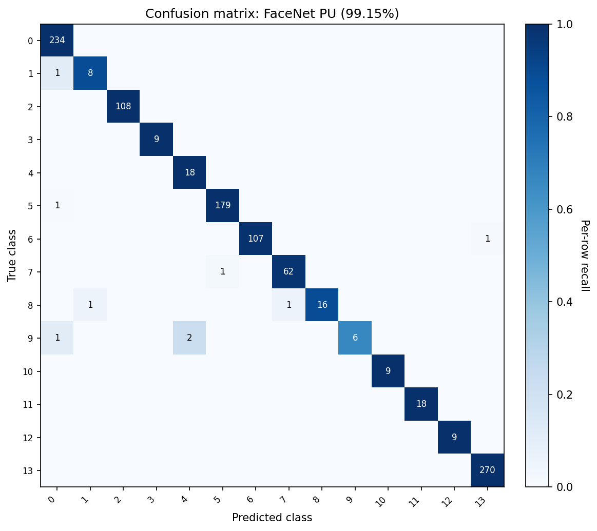

# Experimental Results

This chapter reports the experimental results. Detection is benchmarked on surveillance frames for speed and for ground-truth quality (precision, recall, F1, mean IoU); recognition compares the three FaceNet fine-tuning strategies on the custom 14-class dataset for accuracy, efficiency, embedding geometry, and open-set verification, qualified by a five-seed cross-validation. Detection benchmarks ran CPU-only on 19 frames; recognition used the 7,080-image dataset with a 65/20/15 split and a held-out test set of 1,062 samples.

## Detection results

Four detectors were benchmarked on the same 19 raw surveillance frames, hand-annotated in LabelMe with 26 ground-truth face boxes. Each detector ran in an isolated CPU-only subprocess; predicted boxes were matched to ground truth by greedy Intersection-over-Union (IoU) at threshold 0.5, giving true positives, false positives, and false negatives, from which precision, recall, F1, and mean IoU follow. The 19-frame set is small because detection metrics need human-drawn boxes, which the wider cropped corpus (Chapter 4) does not carry.

**Table 6.1: Detection speed (19 surveillance frames, 800 px max, CPU-only)**

| Method | Avg Time (ms) | Min Time (ms) | Max Time (ms) | FPS |
|--------|--------------|---------------|---------------|-----|
| MediaPipe | 4.2 | 3.0 | 6.0 | 238.3 |
| Haar Cascade | 39.2 | 19.7 | 56.4 | 25.5 |
| Dlib HOG | 167.8 | 126.1 | 200.8 | 6.0 |
| MTCNN | 283.3 | 247.9 | 316.8 | 3.5 |

**Table 6.2: Detection quality with ground truth (19 frames, 26 GT boxes, IoU ≥ 0.5)**

| Method | TP | FP | FN | Precision | Recall | F1 | Mean IoU |
|--------|----|----|-----|-----------|--------|-----|----------|
| MTCNN | 18 | 7 | 8 | **0.720** | **0.692** | **0.706** | 0.693 |
| MediaPipe | 4 | 2 | 22 | 0.667 | 0.154 | 0.250 | 0.720 |
| Haar Cascade | 2 | 10 | 24 | 0.167 | 0.077 | 0.105 | 0.774 |
| Dlib HOG | 1 | 9 | 25 | 0.100 | 0.038 | 0.056 | 0.580 |

Speed and quality are inversely related, and no method wins both. MediaPipe runs at 238 FPS --- about 68 times faster than MTCNN --- because of its lightweight single-shot design, but its single-scale operation misses distant and oblique faces, so it recovers only 4 of 26 boxes (recall 0.154) even though the boxes it does return are tight (mean IoU 0.720). MTCNN is the opposite: its three-stage image-pyramid cascade gives the best F1 (0.706) and recall (0.692) but runs at 3.5 FPS. Haar Cascade and dlib HOG are dominated on both axes --- most of their detections are false positives on background texture (10 of 12 and 9 of 10 respectively), which a count-only evaluation would have hidden. Only MediaPipe clears the 30 FPS real-time bar with headroom for the downstream recognition stage, so the system keeps it as the default detector and exposes MTCNN as a configurable high-recall alternative for offline use; Haar and dlib HOG are not recommended on this footage.

## Recognition: three fine-tuning strategies

All three strategies start from the same pre-trained FaceNet backbone (InceptionResNetV1) and adapt it to the 14-class dataset. **Transfer learning** froze the backbone (23.5 M parameters) and trained only a 256-unit head (131 K trainable parameters, 0.56%); it converged in two epochs (about 4 minutes) to 92.84% test accuracy, with a hard ceiling imposed by the frozen features. **Progressive unfreezing** released the backbone top-down over four phases with learning rates decaying from $10^{-3}$ to $10^{-6}$; each phase added a measurable gain (head only about 92%, +4 points at top-20%, +2 points at top-40%, then a final whole-model pass), reaching 99.15% test accuracy --- 9 errors in 1,062 samples --- in about 50 minutes. **Triplet loss** fine-tuned the whole backbone with random online mining and a 0.2 margin over about 90 minutes, reaching 94.63% via a nearest-neighbour classifier on the learned embeddings; its lower accuracy reflects a mismatch between the training objective and the classification metric rather than a weak representation, as the embedding-geometry results below show. Table 6.3 compares all three.

**Table 6.3: FaceNet fine-tuning strategy comparison**

| Metric | Transfer Learning | Progressive Unfreezing | Triplet Loss |
|--------|----------------|----------------|-------------------|
| Test Accuracy (single-split, canonical) | 92.84% | **99.15%** | 94.63% |
| Test Accuracy (5-seed CV mean ± std) | **96.52% ± 0.46%** | 94.11% ± 0.59% | 87.08% ± 10.33% |
| Validation Accuracy | 91.90% | **99.53%** | N/A (loss-based) |
| Precision | 0.932 | **0.992** | 0.946 |
| Recall | 0.928 | **0.992** | 0.946 |
| F1-Score | 0.928 | **0.991** | 0.946 |
| Training Time | **~4 min** | ~50 min | ~90 min |
| Epochs to Convergence | **2** | 19 | 30 |
| Model Size | **92.7 MB** | 271.9 MB | 270.4 MB |
| Trainable Parameters | 131K (0.56%) | 23.6M (100%) | 23.6M (100%) |
| Open-Set Capable | No | No | **Yes** |

On the single split, progressive unfreezing leads every metric. The five-seed cross-validation row tells a different story and should be read alongside it (see the cross-validation section below). The training curves in Figures 6.1, 6.2, and 6.3 show the dynamics: transfer learning saturates in two epochs under strong frozen-backbone regularization; progressive unfreezing improves stepwise at each phase boundary without regression; triplet loss decreases its embedding loss smoothly, with no per-epoch accuracy to plot.

## Per-class behaviour and class imbalance

The dataset is severely imbalanced --- roughly a 30:1 ratio between the largest class (Yurii, 1,260 images) and the five smallest (about 40 each) --- and per-class accuracy tracks training-set size. Under transfer learning the frozen head is biased toward the majority classes (76 errors, many small-class samples misread as the large Stranger_1), with the smallest classes averaging about 73% accuracy. Progressive unfreezing nearly removes that bias (9 errors, a near-diagonal confusion matrix), lifting the smallest-class group to about 91% and, in the extreme, Stranger_9 from 55.6% to 100%; the gap between the largest- and smallest-class groups narrows from 22 points to under 9. The small classes carry wide confidence intervals --- nine test samples give roughly ±20 points at 95% confidence --- so their per-class figures are indicative, while the overall 99.15% across 1,062 samples is statistically robust.

## Embedding geometry

Classification accuracy is structurally unfair to triplet loss, which never optimised class boundaries. Measuring the 512-dimensional backbone embeddings directly (Table 6.4) reverses the picture: triplet loss produces the tightest intra-class distance (0.337) and the widest inter-class distance (1.254), a separation ratio of 3.72 --- almost double progressive unfreezing's 1.90 --- confirming that it did what its objective claims. Progressive unfreezing wins the silhouette score (0.320), which penalises boundary samples that sit near other clusters, so the two metrics answer different questions: silhouette favours closed-set robustness, the separation ratio favours verification margin. Transfer learning, which leaves the backbone frozen, doubles as the pre-trained-FaceNet baseline.

**Table 6.4: Embedding geometry (FaceNet backbone, 512-D, test set)**

| Metric | Transfer Learning | Progressive Unfreezing | Triplet Loss |
|--------|----------------|----------------|-------------------|
| Avg Intra-class Distance (L2, lower is better) | 0.651 | 0.575 | **0.337** |
| Avg Inter-class Distance (L2, higher is better) | 0.866 | 1.092 | **1.254** |
| Silhouette Score (cosine, higher is better) | 0.111 | **0.320** | 0.170 |
| Separation Ratio (inter / intra) | 1.330 | 1.901 | **3.724** |

## Open-set verification

To turn geometry into operational numbers, a threshold-swept verification protocol ran on 5,000 positive and 5,000 negative pairs sampled from the test set with a fixed seed, using cosine similarity on L2-normalized embeddings. Table 6.5 reports the equal error rate (EER), the true acceptance rate (TAR) at two fixed false acceptance rates (FAR), and the ROC area (AUC); Figures 6.4 and 6.5 show the ROC and DET curves.

**Table 6.5: Open-set verification (5,000 positive + 5,000 negative pairs)**

| Model | EER | TAR @ FAR=0.01 | TAR @ FAR=0.001 | AUC |
|-------|-----|----------------|-----------------|-----|
| Transfer Learning | 0.296 | 0.110 | 0.047 | 0.771 |
| Progressive Unfreezing | **0.090** | **0.632** | **0.307** | **0.971** |
| Triplet Loss | 0.179 | 0.342 | 0.212 | 0.910 |

{width=70%}

{width=70%}

Progressive unfreezing wins every verification metric (EER 0.090, AUC 0.971), ahead of triplet loss (EER 0.179) and transfer learning (EER 0.296). This is the opposite of what the average separation ratio predicted, for two reasons. Verification at a strict FAR depends on the worst-case negative pairs, and triplet loss's wide average margin hides a tail of negative pairs that its fixed 0.2 margin never separated --- the silhouette score already hinted at this. And progressive unfreezing was trained on exactly the 14 identities the pairs are drawn from, so these are in-distribution numbers that do not directly predict performance on unseen identities. The practical reading: progressive unfreezing is stronger for closed-set or in-distribution verification, while triplet loss remains the better bet when the deployed system must enrol identities never seen in training. Figure 6.6 shows the progressive-unfreezing confusion matrix, whose few off-diagonal entries are the small-support classes from the per-class analysis.

{width=60%}

## Cross-validation robustness

All numbers above come from one split. A five-seed sweep (seeds 42, 123, 456, 789, 1024; fifteen training cells, 3 h 22 m total) re-ran every strategy with re-randomised splits and initialisation (Table 6.6).

**Table 6.6: Multi-seed test accuracy**

| Approach | Individual Test Accuracy (seeds 42, 123, 456, 789, 1024) | Mean | Std | Canonical (single-split) |
|----------|----------------------------------------------------------|------|------|--------------------------|
| Transfer Learning | 96.89%, 97.18%, 96.42%, 95.95%, 96.14% | **96.52%** | **0.46%** | 92.84% |
| Progressive Unfreezing | 95.10%, 93.79%, 94.16%, 94.16%, 93.31% | 94.11% | 0.59% | 99.15% |
| Triplet Loss | 91.43%, 90.02%, 96.89%, 67.04%, 90.02% | 87.08% | 10.33% | 94.63% |

The sweep changes the interpretation in three ways. The accuracy ranking reverses: under cross-validation it is transfer learning (96.52%) > progressive unfreezing (94.11%) > triplet loss (87.08%). Two canonical numbers are favorable outliers --- progressive unfreezing's 99.15% sits about eight standard deviations above its CV mean, and transfer learning's 92.84% is an underestimate because the canonical run early-stopped at epoch 2 while the seed reruns trained to convergence. And triplet loss is unstable: its accuracies span 67.04% to 96.89%, with the seed-789 collapse a known failure mode of random triplet mining --- the very problem that batch-hard mining [CITE: hermans2017triplet] was designed to fix. The qualitative claim that progressive unfreezing adapts the backbone well still holds (small variance, a consistent embedding-geometry advantage), but the single-split margin over transfer learning does not survive cross-validation. For context, the original FaceNet reached 99.63% on LFW with a corpus about 1,000 times larger [CITE: schroff2015facenet]; reaching a 94--99% range here on 7,080 images supports the claim that adapting a strong pre-trained backbone closes most of the small-data gap.

## Discussion and limitations

Progressive unfreezing won the single split because it removes transfer learning's fixed-representation ceiling while avoiding the instability of full fine-tuning from the start, and its advantage in embedding geometry and verification is consistent across seeds even though the single-split accuracy margin is not. Triplet loss underperformed on classification mainly because random online mining selects many uninformative triplets and is seed-sensitive; semi-hard or batch-hard mining [CITE: schroff2015facenet; hermans2017triplet] would likely help, and the class imbalance compounds the problem for small identities.

The evaluation has clear limits. All recognition results come from one 14-class dataset, so the absolute figures may not generalise across cameras or demographics, though the relative comparison should. The verification pairs are drawn from the training identities, so they measure in-distribution rather than true open-set behaviour; a disjoint-identity benchmark would be fairer. Five of the 14 classes have only nine test samples (±20-point confidence intervals), and the detection set is 19 frames --- both large enough to show the big gaps but not to pin down absolute numbers. Timing is CPU- and hardware-specific. These limitations set the direction for the future work noted in the conclusion.
